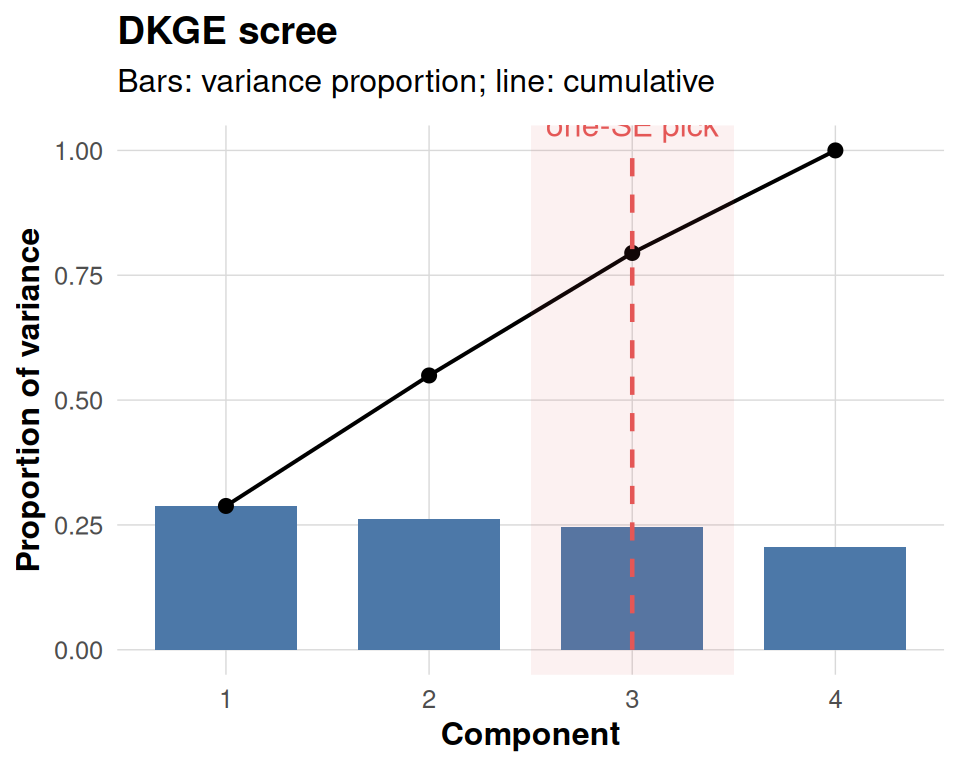
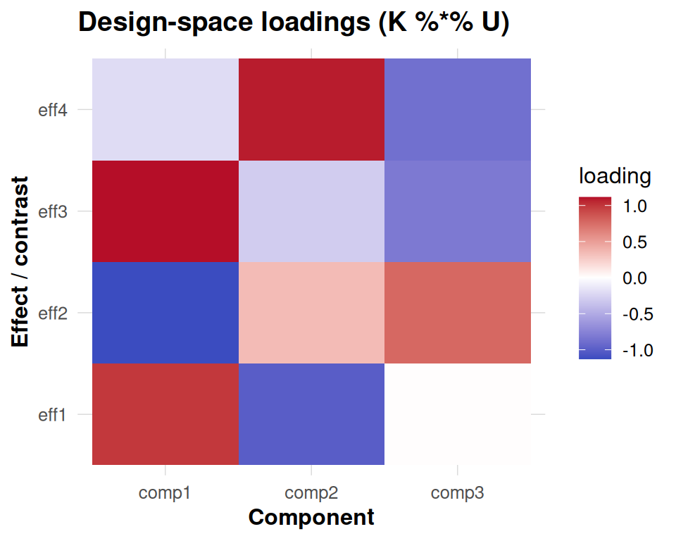
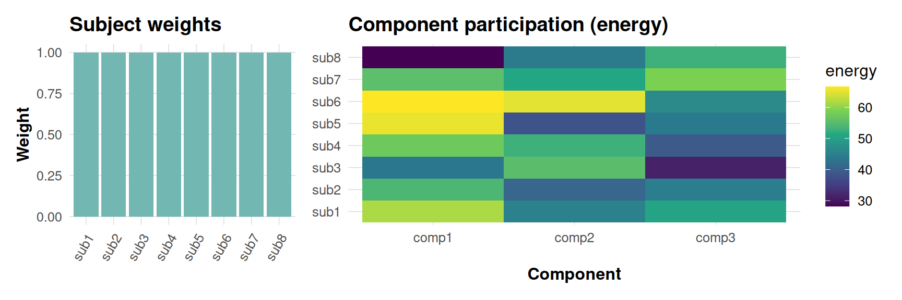
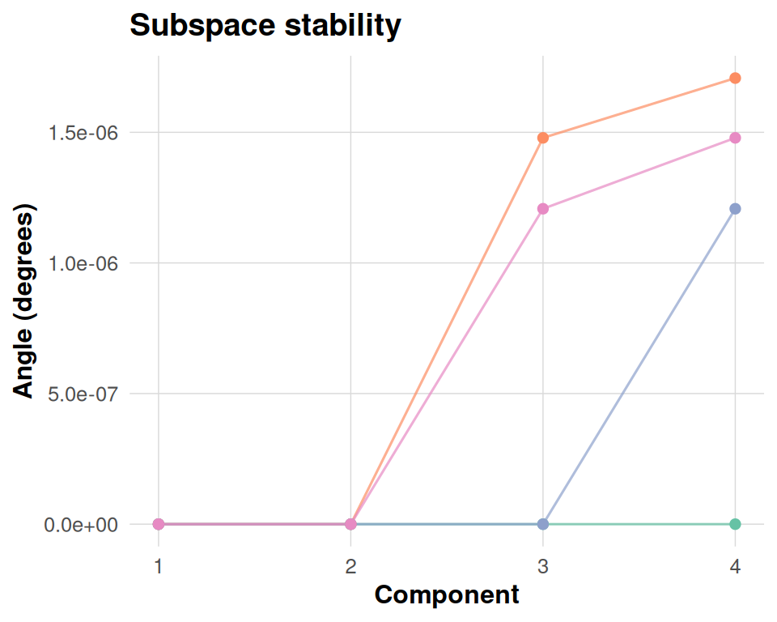
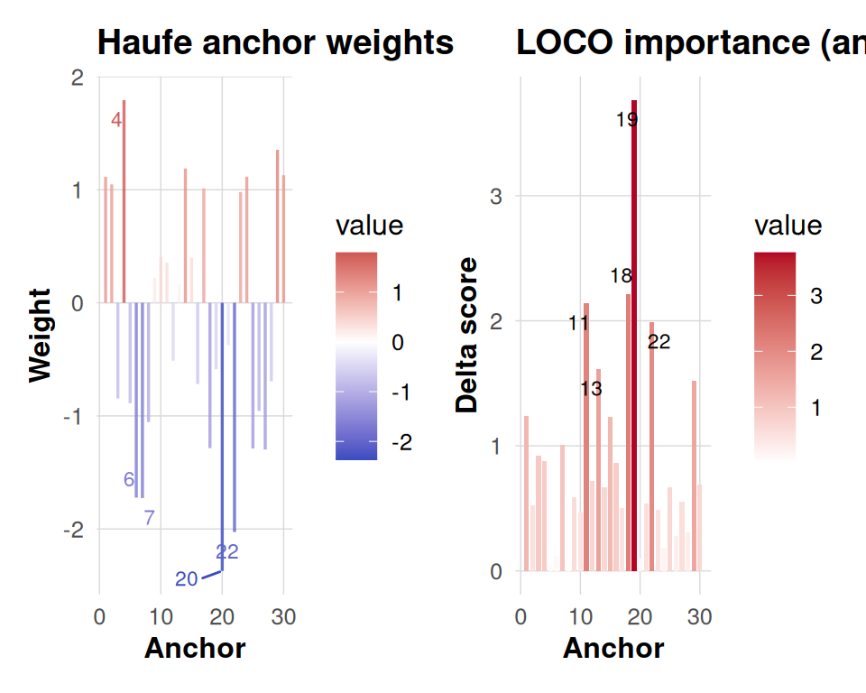
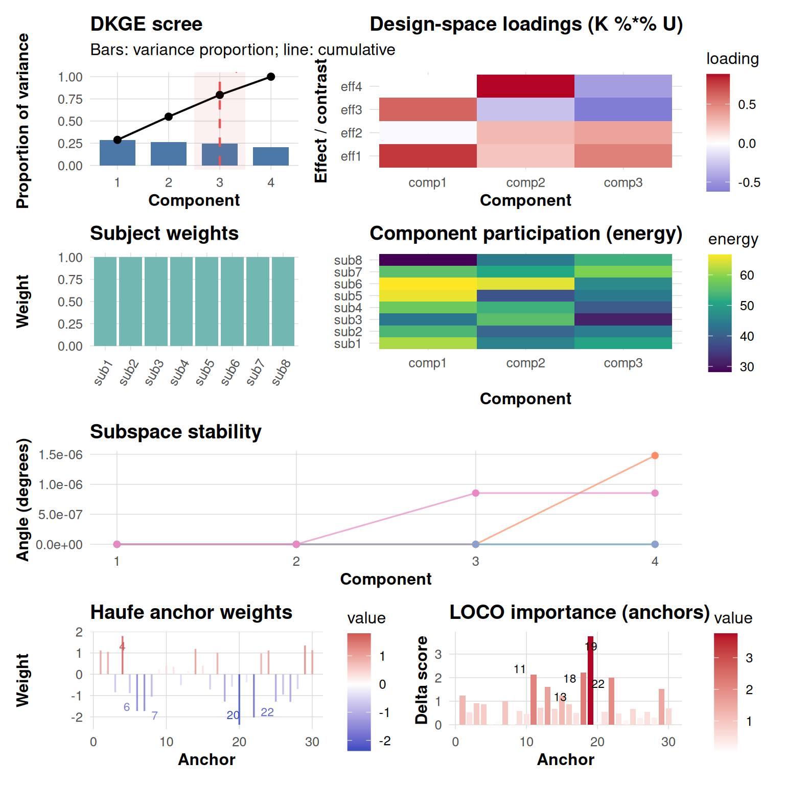

# Plotting DKGE Fits

This vignette provides a comprehensive walkthrough of the new plotting
helpers bundled with DKGE. Our approach involves simulating a small
dataset with known factorial structure, fitting the DKGE model, and then
showcasing what we call the “Five Fundamentals” — a core set of
diagnostic visualizations that together provide essential insights into
model quality and interpretability.

These five fundamental diagnostics include: first, a scree plot enhanced
with one-SE overlay for rank selection guidance; second, an effect-space
loadings heatmap that reveals how design factors contribute to each
component; third, subject contribution plots that decompose both weights
and energy across individuals; fourth, subspace stability analysis using
principal angles to assess cross-validation robustness; and finally,
anchor-level information maps that display both Haufe transformations
and leave-one-covariate-out (LOCO) importance scores.

All plots are designed with a unified visual styling achieved through
[`theme_dkge()`](https://bbuchsbaum.github.io/dkge/reference/theme_dkge.md),
ensuring consistency across the entire analysis workflow. Moreover,
these individual plots can be seamlessly composed into a single
comprehensive dashboard using the
[`dkge_plot_suite()`](https://bbuchsbaum.github.io/dkge/reference/dkge_plot_suite.md)
function.

## Prerequisites

``` r
library(dkge)
library(ggplot2)
library(patchwork)
```

The information-map plotting functions provide enhanced labeling
capabilities by optionally utilizing the `ggrepel` package to annotate
top anchors with non-overlapping text placement. When `ggrepel` is not
available in your environment, the code gracefully falls back to
standard base text labels to ensure functionality is maintained.

## Simulate a toy dataset

We begin by generating a small synthetic dataset manually. Each subject
has a diagonal design matrix (one column per effect), and we add modest
signal plus noise so the latent components are recoverable but not
trivial. Using this construction keeps the vignette self-contained and
avoids dependencies on specialised simulators while still providing
deterministic ground truth for the plots.

``` r
q <- 4L   # number of effects
P <- 30L  # clusters (voxels) per subject
S <- 8L   # subjects

make_subject <- function(id) {
  design <- diag(q)
  colnames(design) <- paste0('eff', seq_len(q))
  signal <- matrix(rnorm(q * P, sd = 0.4), nrow = q)
  noise <- matrix(rnorm(q * P, sd = 0.2), nrow = q)
  dkge_subject(signal + noise, design = design, id = paste0('sub', id))
}

subjects <- lapply(seq_len(S), make_subject)
K <- diag(q)
fit <- dkge(subjects, K = K, rank = 4, w_method = 'none')
```

## Auxiliary objects

We now produce helper objects used in later sections. In a production
pipeline you would typically obtain LOSO-aligned bases via
`dkge_contrast(..., align = TRUE)` and real information maps from
[`dkge_info_map_haufe()`](https://bbuchsbaum.github.io/dkge/reference/dkge_info_map_haufe.md)
/
[`dkge_info_map_loco()`](https://bbuchsbaum.github.io/dkge/reference/dkge_info_map_loco.md).
Here we synthesise lightweight placeholders so the plots remain
deterministic.

To illustrate subspace stability we create a few perturbed versions of
the fitted basis and re-orthonormalise them in the $K$-metric.

``` r
# In practice you can retrieve per-fold bases from
# dkge_contrast(..., align = TRUE)$metadata$bases.
# Here we synthesise a few perturbations for illustration.
fit_U <- fit[['U']]
bases <- replicate(4, {
  perturb <- matrix(rnorm(length(fit_U), sd = 0.02), nrow = nrow(fit_U))
  dkge_k_orthonormalize(fit_U + perturb, fit[['K']])
}, simplify = FALSE)
base_labels <- paste0('base', seq_along(bases))
```

The information-map visualization requires anchor-level results from
either Haufe transformation analysis or leave-one-covariate-out (LOCO)
importance calculations. Since we are working with a synthetic example
for demonstration purposes, we create mock anchor vectors that simulate
these outputs. In a real-world analysis, you would replace these
placeholder vectors with actual Haufe or LOCO results computed from your
fitted model.

``` r
fake_haufe <- list(mean_anchor = rnorm(30))
fake_loco  <- list(loco_anchor = rexp(30))
```

## Individual plots

### Scree

``` r
# For illustrative purposes we annotate the scree at component 3.
# In a real analysis you would obtain this optimal rank from dkge_cv_rank_loso()
# or dkge_cv_kernel_rank() cross-validation procedures.
one_se_pick <- 3
dkge_plot_scree(fit, one_se_pick = one_se_pick)
```



### Effect-space loadings

``` r
dkge_plot_effect_loadings(fit, comps = 1:3, zscore = TRUE)
```



### Subject contributions

[`dkge_plot_subject_contrib()`](https://bbuchsbaum.github.io/dkge/reference/dkge_plot_subject_contrib.md)
returns two linked panels. The left panel simply visualises the
subject-level weights that were used while fitting the model
(`fit$weights`). Those weights depend on the `w_method` argument passed
to [`dkge()`](https://bbuchsbaum.github.io/dkge/reference/dkge.md): in
this vignette we deliberately chose `w_method = "none"`, so each subject
keeps unit weight and the bars are all equal to one. Switching to
`"mfa_sigma1"` or `"energy"` would display the corresponding MFA-style
or energy-based weighting actually used in the eigensolve. The heatmap
on the right shows how much norm (“energy”) each subject contributes to
the selected components after those weights have been applied.

``` r
contrib <- dkge_plot_subject_contrib(fit, comps = 1:3)
contrib$weights + contrib$energy + patchwork::plot_layout(widths = c(1, 2))
```



### Subspace stability

This diagnostic compares each cross-validated basis (or synthetic
perturbation here) against a consensus basis by computing principal
angles in the $K$ metric. Smaller angles mean that a base reproduces the
consensus component more closely, so parallel lines near zero indicate a
stable subspace, whereas large excursions highlight folds or components
that deviate materially.

``` r
dkge_plot_subspace_stability(bases, K = fit[['K']], labels = base_labels)
```



### Information maps

The information panels translate component patterns back to anchor
space. The Haufe transformation re-expresses each component in terms of
observable anchor weights, making it easier to interpret which clusters
drive a latent effect once you account for the whitening in the
eigensolve. The LOCO panel measures how the objective would drop if each
anchor were removed in turn, so tall positive bars flag anchors that
materially support the fit. Together they provide a bridge between
latent structure and spatial attribution.

``` r
panels <- dkge_plot_info_anchor(info_haufe = fake_haufe,
                                info_loco = fake_loco,
                                top = 5)
panels$haufe + panels$loco
```



## The “Five Fundamentals” dashboard

``` r
dkge_plot_suite(fit,
                one_se_pick = one_se_pick,
                comps = 1:3,
                bases = bases,
                consensus = fit[['U']],
                base_labels = base_labels,
                info_haufe = fake_haufe,
                info_loco = fake_loco,
                top = 5)
```



The
[`dkge_plot_suite()`](https://bbuchsbaum.github.io/dkge/reference/dkge_plot_suite.md)
function intelligently arranges all five fundamental diagnostic panels
into a coherent, publication-ready dashboard with consistent spacing and
visual hierarchy. When you provide real Haufe transformation and LOCO
importance results, the function seamlessly incorporates these into the
final row of visualizations. Conversely, if these anchor-level analyses
are omitted from your call, the layout automatically adapts by placing
an informative placeholder message in their position, ensuring the
dashboard remains structurally sound.

## Saving the dashboard

``` r
dkge_plot_suite(fit,
                bases = bases,
                consensus = fit[['U']],
                base_labels = base_labels,
                info_haufe = fake_haufe,
                info_loco = fake_loco,
                save_path = "dkge_dashboard.png",
                width = 10,
                height = 10)
```

## Summary

The DKGE plotting helpers are intentionally designed with computational
efficiency and visual clarity as primary goals. They operate exclusively
in the low-dimensional design space rather than in high-dimensional
voxel space, ensuring fast rendering even for complex models. All
functions inherit a cohesive visual theme that maintains consistency
across different plot types, while simultaneously supporting both rapid
exploratory inspection and publication-quality dashboard generation.

These plotting tools offer considerable flexibility to accommodate
different analytical workflows. For interactive exploration and
hypothesis generation, you can embed individual diagnostic panels
directly inline within your analysis notebooks. When conducting formal
model quality assurance, you can capture high-resolution snapshots using
standard R graphics functions like
[`png()`](https://rdrr.io/r/grDevices/png.html) or
[`ggsave()`](https://ggplot2.tidyverse.org/reference/ggsave.html) for
documentation and reporting purposes. For more comprehensive
presentations, you can extend the basic five-panel suite by
incorporating additional visualization rows — such as brain rendering
panels showing voxel-level activations — through the powerful layout
capabilities provided by the patchwork package ecosystem.

Happy plotting!
