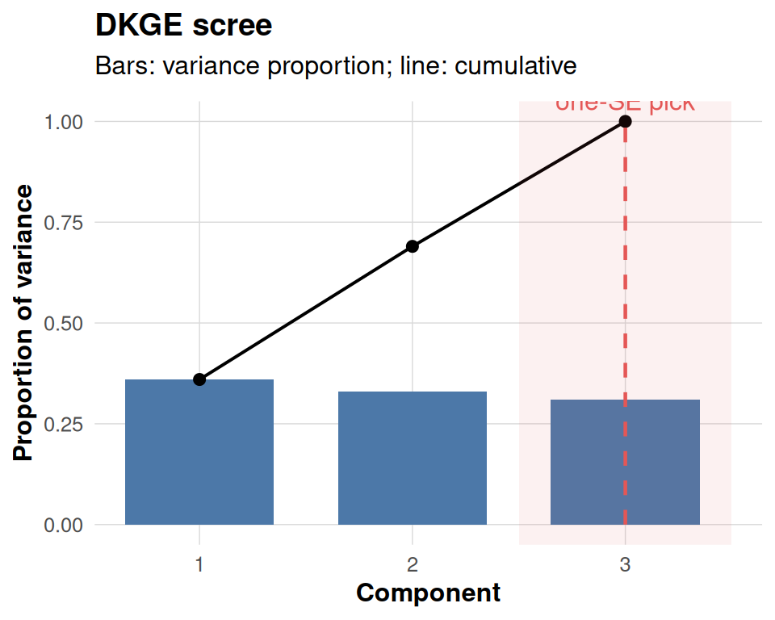
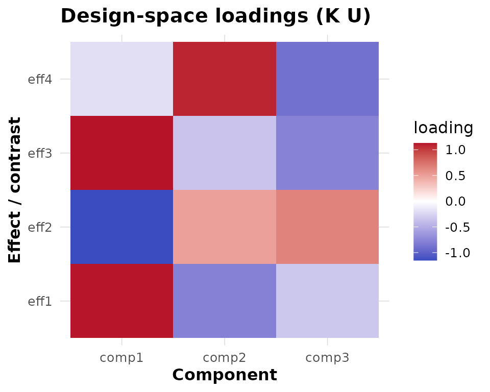
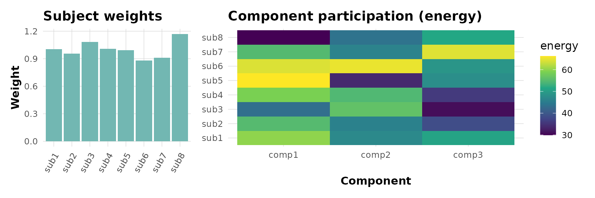
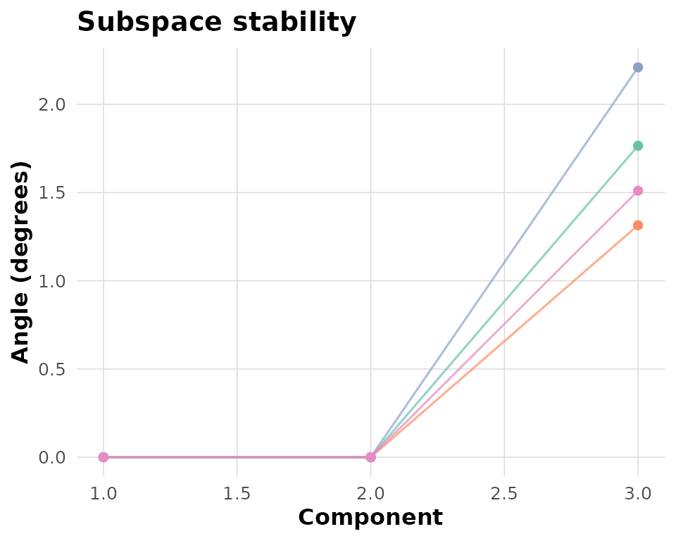
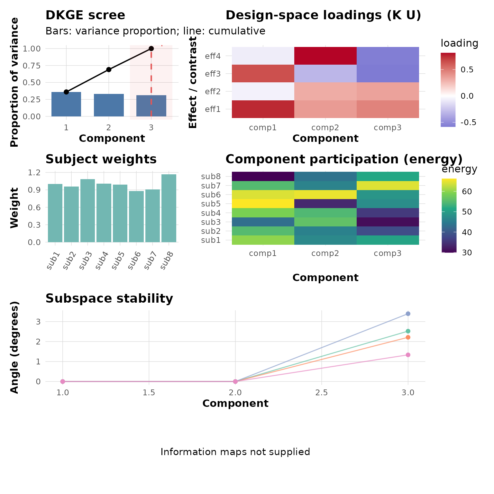

# Plotting DKGE Fits

This vignette shows how to inspect one DKGE fit without mistaking a
polished figure for statistical evidence. We will plot its
eigenspectrum, effect saliences, subject contributions, and subspace
sensitivity. Each panel answers a descriptive question; none supplies a
p-value or validates the scientific model on its own.

## Prerequisites

``` r

library(dkge)
library(ggplot2)
library(patchwork)
```

The information-map plotting functions provide enhanced labeling
capabilities by optionally utilizing the `ggrepel` package to annotate
top anchors with non-overlapping text placement. When `ggrepel` is not
available in your environment, the code gracefully falls back to
standard base text labels to ensure functionality is maintained.

## Simulate a toy dataset

We begin by generating a small synthetic dataset manually. Each subject
has a diagonal design matrix (one column per effect), and we add modest
signal plus noise so the latent components are recoverable but not
trivial. Using this construction keeps the vignette self-contained and
avoids dependencies on specialised simulators while still providing
deterministic ground truth for the plots.

``` r

q <- 4L   # number of effects
P <- 30L  # clusters (voxels) per subject
S <- 8L   # subjects

make_subject <- function(id) {
  design <- diag(q)
  colnames(design) <- paste0('eff', seq_len(q))
  signal <- matrix(rnorm(q * P, sd = 0.4), nrow = q)
  noise <- matrix(rnorm(q * P, sd = 0.2), nrow = q)
  dkge_subject(signal + noise, design = design, id = paste0('sub', id))
}

subjects <- lapply(seq_len(S), make_subject)
K <- diag(q)
fit <- dkge(subjects, K = K, rank = 3, w_method = 'mfa_sigma1')
```

## Auxiliary objects

To explain the stability plot’s input contract, we create perturbed
versions of the fitted rank-three basis and re-orthonormalise them in
the $`K`$-metric. These are controlled sensitivity perturbations, not
cross-validation folds. In an analysis, supply bases actually refitted
inside the relevant folds.

``` r

fit_U <- fit[['U']]
bases <- replicate(4, {
  perturb <- matrix(rnorm(length(fit_U), sd = 0.02), nrow = nrow(fit_U))
  dkge_k_orthonormalize(fit_U + perturb, fit[['K']])
}, simplify = FALSE)
base_labels <- paste0('base', seq_along(bases))
```

The optional information-map panels require real outputs from
[`dkge_info_map_haufe()`](https://bbuchsbaum.github.io/dkge/reference/dkge_info_map_haufe.md)
or
[`dkge_info_map_loco()`](https://bbuchsbaum.github.io/dkge/reference/dkge_info_map_loco.md).
We omit them here because random vectors would demonstrate only the
plotting signature while looking like scientific evidence. See
[`vignette("dkge-classification")`](https://bbuchsbaum.github.io/dkge/articles/dkge-classification.md)
for the classifier workflow that precedes those attribution methods.

## Individual plots

### Scree

``` r

# For illustrative purposes we annotate the scree at component 3.
# In a real analysis you would obtain this optimal rank from dkge_cv_rank_loso()
# or dkge_cv_kernel_rank() cross-validation procedures.
one_se_pick <- 3
dkge_plot_scree(fit, one_se_pick = one_se_pick)
```



### Effect-space loadings

``` r

dkge_plot_effect_loadings(fit, comps = 1:3, zscore = TRUE)
```



### Subject contributions

[`dkge_plot_subject_contrib()`](https://bbuchsbaum.github.io/dkge/reference/dkge_plot_subject_contrib.md)
returns two linked panels. The left panel simply visualises the
subject-level weights that were used while fitting the model
(`fit$weights`). Those weights depend on the `w_method` argument passed
to [`dkge()`](https://bbuchsbaum.github.io/dkge/reference/dkge.md): in
this vignette we deliberately chose `w_method = "none"`, so each subject
keeps unit weight and the bars are all equal to one. Switching to
`"mfa_sigma1"` or `"energy"` would display the corresponding MFA-style
or energy-based weighting actually used in the eigensolve. The heatmap
on the right shows how much norm (“energy”) each subject contributes to
the selected components after those weights have been applied.

``` r

contrib <- dkge_plot_subject_contrib(fit, comps = 1:3)
contrib$weights + contrib$energy + patchwork::plot_layout(widths = c(1, 2))
```



### Subspace stability

This diagnostic compares each supplied basis (controlled perturbations
here) against a consensus basis by computing principal angles in the
$`K`$ metric. Smaller angles mean that a base reproduces the consensus
component more closely, so parallel lines near zero indicate a stable
subspace, whereas large excursions highlight folds or components that
deviate materially.

``` r

dkge_plot_subspace_stability(bases, K = fit[['K']], labels = base_labels)
```



## Combine the fit diagnostics

``` r

dkge_plot_suite(fit,
                one_se_pick = one_se_pick,
                comps = 1:3,
                bases = bases,
                consensus = fit[['U']],
                base_labels = base_labels,
                top = 5)
```



[`dkge_plot_suite()`](https://bbuchsbaum.github.io/dkge/reference/dkge_plot_suite.md)
arranges the available panels and leaves the attribution row empty when
Haufe/LOCO results are absent. Before reporting the dashboard, replace
the sensitivity perturbations with actual refitted bases and interpret
each panel next to the numerical diagnostic that produced it.

## Saving the dashboard

``` r

dkge_plot_suite(fit,
                bases = bases,
                consensus = fit[['U']],
                base_labels = base_labels,
                save_path = "dkge_dashboard.png",
                width = 10,
                height = 10)
```

## Summary

Use the scree plot to describe retained variation, the salience heatmap
to name effect directions, the contribution panels to detect subject
dominance, and principal angles to summarize refit sensitivity. Save the
figure only after the objects behind those panels come from the analysis
being reported. Visual coherence improves communication; it does not
upgrade descriptive diagnostics into inferential evidence.
