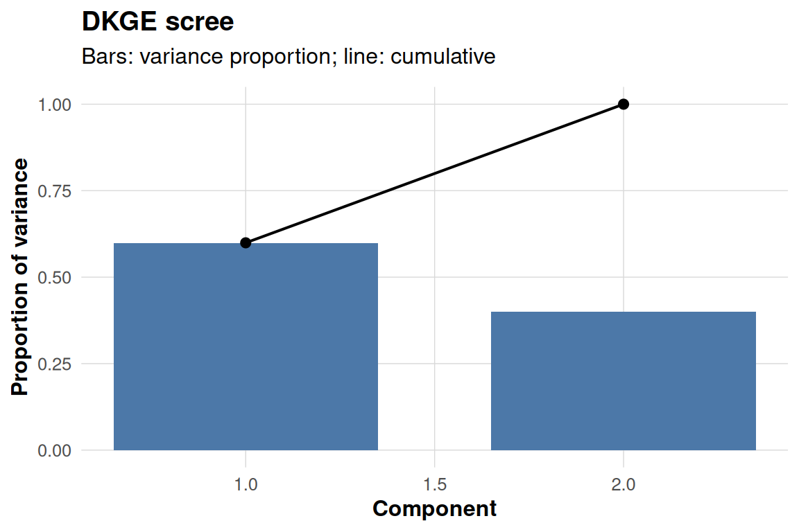
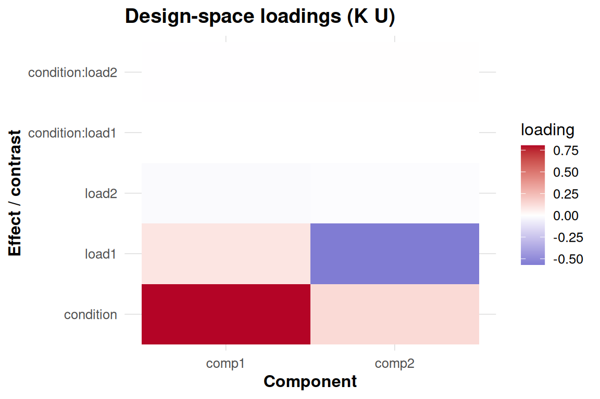

# DKGE Workflow: From Subject Betas to a Shared Map

Suppose each subject has a GLM beta matrix in a common effect space but
a different spatial parcellation. Your practical goal is to learn a
shared effect-space representation, evaluate a planned contrast on
held-out subjects, and place those subject-specific contrast fields on
one reference parcellation.

This page follows that one path. It uses synthetic data so the code is
self-contained; replace the beta matrices, design matrices, and
centroids with your own. If `q by P_s` and “design kernel” are not yet
familiar, begin with
[`vignette("dkge")`](https://bbuchsbaum.github.io/dkge/articles/dkge.md).

## What are the inputs?

We use a 2 by 3 factorial design with a planted condition and load
signal. Six subjects have different numbers of clusters, which is the
reason transport is needed later.

``` r

toy <- dkge_sim_toy(
  factors = list(condition = list(L = 2), load = list(L = 3)),
  active_terms = c("condition", "load"),
  S = 6, P = c(16, 18, 15, 17, 16, 19), snr = 4, seed = 2024
)
vapply(toy$B_list, dim, integer(2))
#>      [,1] [,2] [,3] [,4] [,5] [,6]
#> [1,]    5    5    5    5    5    5
#> [2,]   16   18   15   17   16   19
```

The output confirms a common number of effect rows and subject-specific
cluster counts. In real data, beta-row names must match design-column
names.
[`dkge_data()`](https://bbuchsbaum.github.io/dkge/reference/dkge_data.md)
validates that contract and preserves subject IDs.

``` r

data_bundle <- dkge_data(
  toy$B_list, designs = toy$X_list, subject_ids = toy$subject_ids
)
c(subjects = length(data_bundle$subject_ids), effects = data_bundle$q)
#> subjects  effects 
#>        6        5
```

**Next operation:** fit a low-rank group basis. If your subjects lack
effects or have very unequal cell precision, stop here and read
[`vignette("dkge-partial-effect-spaces")`](https://bbuchsbaum.github.io/dkge/articles/dkge-partial-effect-spaces.md)
first.

## What is the baseline fit?

Start with an identity kernel. It retains the GLM/design scaling but
adds no kernel-imposed similarity between effects.

``` r

K_identity <- diag(data_bundle$q)
fit_identity <- dkge(data_bundle, K = K_identity, rank = 2, w_method = "none")
dkge_plot_scree(fit_identity)
```



This fit returns a two-column group basis `fit_identity$U`. The scree
plot describes variation represented by those components; it does not
establish their reliability or scientific importance.

**Output:** an unconstrained effect-space baseline.

**Next operation:** fit the scientifically motivated kernel and compare
it with this baseline.

## What changes when the design kernel is used?

The simulator supplies the structured kernel used to plant the signal. A
real analysis would construct this object explicitly with
[`design_kernel()`](https://bbuchsbaum.github.io/dkge/reference/design_kernel.md)
and prespecify the included terms. Both fits disable subject block
weighting so the comparison isolates the kernel change.

``` r

fit_structured <- dkge(data_bundle, K = toy$K, rank = 2, w_method = "none")

comparison <- data.frame(
  component = 1:2,
  identity = dkge_variance_explained(fit_identity)$prop_var,
  structured = dkge_variance_explained(fit_structured)$prop_var
)
round(comparison, 3)
#>   component identity structured
#> 1         1    0.599       0.58
#> 2         2    0.401       0.42
```

Compare the retained subspaces as well as the scree values. Because the
bases use a kernel metric, a raw
[`crossprod()`](https://rdrr.io/pkg/Matrix/man/matmult-methods.html) is
not a valid rotation comparison.

``` r

angles <- dkge_principal_angles_K(
  fit_identity$U, fit_structured$U, fit_structured$K
)
round(angles * 180 / pi, 1)
#> [1] 0 0
```

Here component 1 accounts for 59.9% of the retained variation under the
identity kernel and 58% under the structured kernel. Both principal
angles round to 0 and 0 degrees: the kernel changes how variation is
allocated within this seeded two-dimensional subspace, but not the
subspace itself at displayed precision. This is a sensitivity
comparison, not a test of which kernel is true.

**Output:** a structured fit plus an explicit record of how it differs
from the identity baseline.

**Next operation:** inspect effect saliences, then specify the contrast
you actually want to estimate.

## Which effect directions define the components?

``` r

dkge_plot_effect_loadings(fit_structured, comps = 1:2)
```



The heatmap displays $`K U`$: effect-space saliences, not voxel
coefficients. Look for coherent relative patterns within a component. Do
not compare a component’s arbitrary sign across independent fits without
alignment.

## How do you obtain held-out contrast fields?

Build the contrast in fitted effect order. Here the simulator identifies
the coordinate for the planted condition term.

``` r

condition_contrast <- numeric(data_bundle$q)
condition_contrast[toy$active_cols$condition] <- 1

condition_loso <- dkge_contrast(
  fit_structured,
  list(condition = condition_contrast),
  method = "loso"
)
condition_loso
#> DKGE Contrasts
#> --------------
#> Method: loso
#> Contrasts: 1
#> Subjects: 6
#> Contrast names: condition
```

The output is a named list of six subject-specific cluster vectors. LOSO
cross-fitting keeps each subject out of the basis used to score that
subject. It does not make a randomized causal contrast out of an
observational design, nor does it supply group uncertainty by itself.

**Output:** one cross-fitted contrast field per subject, still indexed
by that subject’s clusters.

**Next operation:** transport those fields before stacking or performing
feature-level group inference.

## How do subject fields reach one parcellation?

Transport needs real spatial features, normally cluster centroids in a
common coordinate system. The synthetic coordinates below exist only to
demonstrate the interface; their resulting map has no anatomical
interpretation.

``` r

centroids <- lapply(seq_along(toy$B_list), function(s) {
  p <- ncol(toy$B_list[[s]])
  cbind(x = seq_len(p), y = rep(s / 100, p), z = rep(0, p))
})
```

Use the ridge mapper for a dependency-light example and select subject 1
as the reference parcellation:

``` r

transported <- dkge_transport_contrasts_to_medoid(
  fit_structured,
  condition_loso,
  medoid = 1,
  centroids = centroids,
  method = "ridge"
)
dim(transported$condition$subj_values)
#> [1]  6 16
```

The returned matrix has subjects in rows and reference clusters in
columns; `transported$condition$value` is its across-subject median on
the medoid parcellation. The attached `attr(transported, "cache")` can
be reused for other contrasts or resampling.

Transport quality depends on the features, masses, mapper, and reference
choice. Inspect mapper diagnostics and repeat defensible sensitivity
analyses; a successful matrix multiplication is not evidence that
parcels are biologically homologous.

## What should you save and report?

For a reproducible analysis, retain:

- effect names and the design matrices used to produce each beta matrix;
- the identity and structured kernels, their construction parameters,
  and the chosen rank;
- the identity-versus-structured comparison;
- cross-fitting folds or LOSO specification;
- cluster coordinates, masses, mapper settings, medoid choice, and
  transport diagnostics; and
- the inference unit and multiplicity procedure for every reported
  claim.

Continue with
[`vignette("dkge-concepts")`](https://bbuchsbaum.github.io/dkge/articles/dkge-concepts.md)
for the fitted moment and inference levels,
[`vignette("dkge-contrasts-inference")`](https://bbuchsbaum.github.io/dkge/articles/dkge-contrasts-inference.md)
for uncertainty, and
[`vignette("dkge-weighting")`](https://bbuchsbaum.github.io/dkge/articles/dkge-weighting.md)
for the distinct roles of spatial, effect, subject, and transport
weights.
