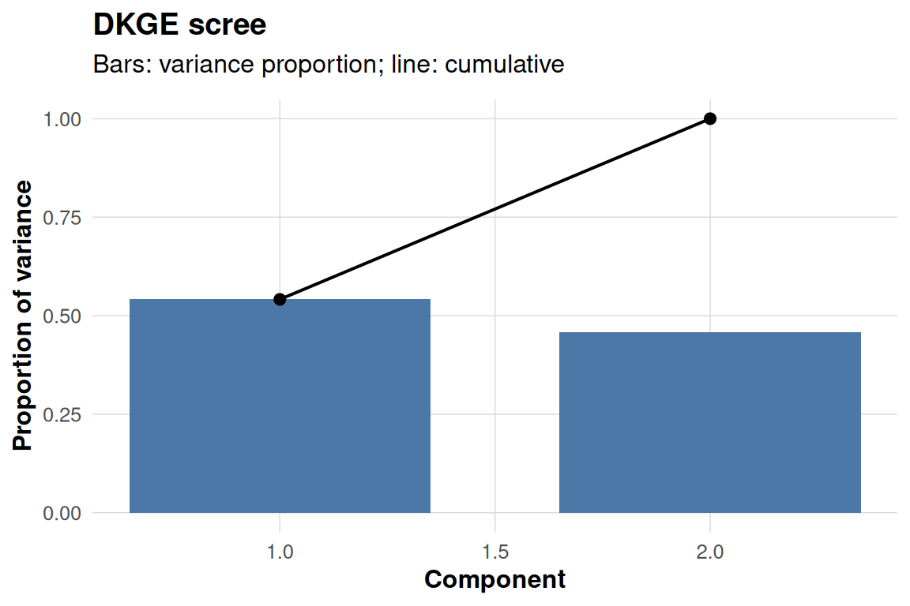

# Getting Started with DKGE

``` r

library(dkge)
```

You have one GLM beta matrix per subject. Its rows are the same named
design effects, but its columns may be different subject-specific
clusters. You want to find effect-space directions that recur across
subjects, inspect what those directions express, and evaluate a planned
contrast without constructing a voxel-by-voxel group covariance matrix.

DKGE takes those beta matrices, their design matrices, and a design
kernel. It returns a low-dimensional group basis in effect space plus
subject-level cluster values that can be cross-fitted and, when
coordinates are available, transported to a common parcellation.

## Can you fit a complete example?

The package includes a simulator with known factorial structure. Here
the planted signal involves two main effects in a 2 by 3 design. Each
subject has a 5 by 20 beta matrix: five effect rows and twenty clusters.

``` r

toy <- dkge_sim_toy(
  factors = list(condition = list(L = 2), load = list(L = 3)),
  active_terms = c("condition", "load"),
  S = 5, P = 20, snr = 5, seed = 42
)
dim(toy$B_list[[1]])
#> [1]  5 20
```

The three objects needed for a first fit are `toy$B_list` (subject beta
matrices), `toy$X_list` (matching design rulers), and `toy$K` (the
effect-space kernel). Fit two components:

``` r

fit <- dkge(toy$B_list, toy$X_list, K = toy$K, rank = 2)
dkge_plot_scree(fit)
```



The bars show each retained component’s share of the fitted q-space
variation; the line is cumulative. This is a descriptive summary of the
fitted latent space, not a significance test.

## What does a component express?

Inspect the design-weighted saliences, $`K U`$, before mapping anything
back to space. Rows are effects and columns are components.

``` r

round(dkge_component_saliences(fit, comps = 1:2, long = FALSE), 2)
#>                  LV1   LV2
#> condition       0.81 -0.06
#> load1           0.04  0.58
#> load2           0.01  0.01
#> condition:load1 0.00  0.00
#> condition:load2 0.00  0.00
```

Large positive and negative entries identify the effect directions
associated with each component. Component signs are arbitrary, so
interpret relative patterns rather than treating the sign itself as
scientifically meaningful.

**Next operation:** use `dkge_plot_effect_loadings(fit)` for a heatmap,
or move to a prespecified effect contrast.

## How do you evaluate a contrast without reusing each subject’s data?

Construct a contrast in the same effect order as the fit. The simulator
records which effect coordinate carries the planted `condition` term.

``` r

condition_contrast <- numeric(nrow(toy$K))
condition_contrast[toy$active_cols$condition] <- 1

condition_loso <- dkge_contrast(
  fit, list(condition = condition_contrast), method = "loso"
)
condition_loso
#> DKGE Contrasts
#> --------------
#> Method: loso
#> Contrasts: 1
#> Subjects: 5
#> Contrast names: condition
```

`method = "loso"` refits the latent basis without each held-out subject
before computing that subject’s cluster values. The result contains one
vector per subject under `condition_loso$values$condition`; those
vectors still live on the subjects’ own cluster systems.

Cross-fitting limits basis-reuse optimism; it does not by itself provide
a population p-value, spatial multiplicity correction, or causal
interpretation. Those require an inference procedure matched to the
claim and an experimental design that supports the interpretation.

**Next operation:** if clusters differ across subjects, transport the
contrast with
[`dkge_transport_contrasts_to_medoid()`](https://bbuchsbaum.github.io/dkge/reference/dkge_transport_contrasts_to_medoid.md).
If they already share a common index, `as.matrix(condition_loso)` stacks
them directly.

## What must your real data look like?

For subject $`s`$, supply:

- a numeric `q` by `P_s` beta matrix, where rows are named effects and
  columns are clusters, parcels, or voxels;
- a numeric `T_s` by `q` design matrix whose column names match the
  beta-row names; and
- optionally, cluster weights, coordinates, effect counts, or
  trial-level sufficient statistics needed by later stages.

Wrap subjects with
[`dkge_subject()`](https://bbuchsbaum.github.io/dkge/reference/dkge_subject.md)
when you want validation and provenance, then combine them with
[`dkge_data()`](https://bbuchsbaum.github.io/dkge/reference/dkge_data.md).
Subjects may have different `P_s`. If some effects are unobserved,
declare that explicitly; DKGE records coverage and does not treat an
absent effect as an observed zero.

``` r

subjects <- Map(
  function(beta, design, id) dkge_subject(beta, design = design, id = id),
  toy$B_list, toy$X_list, toy$subject_ids
)
data_bundle <- dkge_data(subjects)
c(subjects = length(data_bundle$subject_ids), effects = data_bundle$q)
#> subjects  effects 
#>        5        5
```

For unequal trial counts or missing design cells, continue with
[`vignette("dkge-partial-effect-spaces")`](https://bbuchsbaum.github.io/dkge/articles/dkge-partial-effect-spaces.md)
before fitting.

## Which page should you read next?

The default path is:

1.  [`vignette("dkge-workflow")`](https://bbuchsbaum.github.io/dkge/articles/dkge-workflow.md)
    — take the same objects through fit, comparison, cross-fitted
    contrast, and spatial transport.
2.  [`vignette("dkge-concepts")`](https://bbuchsbaum.github.io/dkge/articles/dkge-concepts.md)
    — understand the kernel metric, the fitted moment, and the distinct
    levels of inference.
3.  [`vignette("dkge-design-kernels")`](https://bbuchsbaum.github.io/dkge/articles/dkge-design-kernels.md)
    — construct a kernel for your own design.
4.  [`vignette("dkge-contrasts-inference")`](https://bbuchsbaum.github.io/dkge/articles/dkge-contrasts-inference.md)
    — choose uncertainty and testing machinery for a prespecified
    contrast.

Common branches are
[`vignette("dkge-partial-effect-spaces")`](https://bbuchsbaum.github.io/dkge/articles/dkge-partial-effect-spaces.md)
for incomplete or unequally estimated effects,
[`vignette("dkge-weighting")`](https://bbuchsbaum.github.io/dkge/articles/dkge-weighting.md)
for weighting estimands, and
[`vignette("dkge-plotting")`](https://bbuchsbaum.github.io/dkge/articles/dkge-plotting.md)
for presentation.

For function-level help, start with
[`?dkge`](https://bbuchsbaum.github.io/dkge/reference/dkge.md),
[`?dkge_subject`](https://bbuchsbaum.github.io/dkge/reference/dkge_subject.md),
[`?design_kernel`](https://bbuchsbaum.github.io/dkge/reference/design_kernel.md),
and
[`?dkge_contrast`](https://bbuchsbaum.github.io/dkge/reference/dkge_contrast.md).
